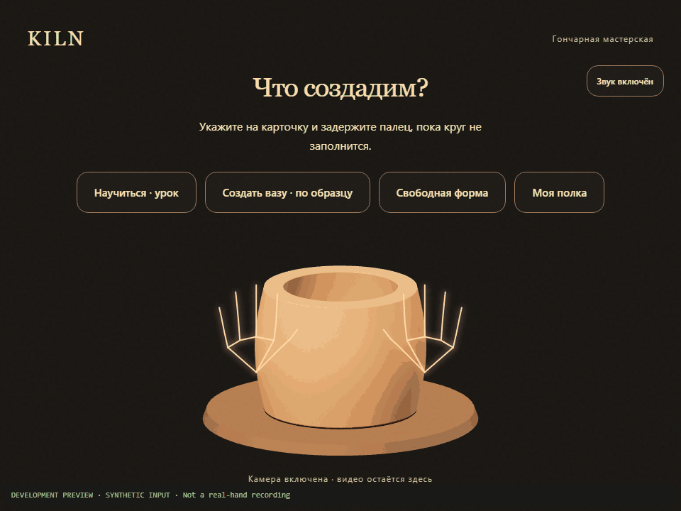

# KILN

**Team: Avivengers**

A virtual pottery wheel controlled by hand gestures through a webcam. A browser game model with Russian UI.

[Live HTTPS site](https://kiln-delta-rose.vercel.app)



*The GIF is a labelled development preview using keyboard/mouse fixtures, not a recording of real hand recognition.*

Wait for the hand model, click «Начать» once and allow the camera. Hold both hands still for calibration, then point at a menu button and dwell for 0.9 seconds. After system camera permission, in-app navigation is designed to work with gestures. Tutorial, commission/free shaping, three glazes, firing, results, PNG export and a local gallery are implemented.

**Interaction update in progress:** the user's new four-action specification is in [GESTURES_V4.md](docs/GESTURES_V4.md). Core recognition/cavity changes remain assigned to A; the current build still has the v3 shaping controls below. Do not treat the proposed new actions or real-camera T22 as verified.

## Current controls

| Action | Gesture |
|---|---|
| Shape | Open both palms at opposite side walls, at the same height; move them in/out |
| Pull taller (v3) | Pinch thumb/index on both hands and move both upward |
| Compress/repair (v3) | Make two fists and move both downward |
| Finish | Hold both open palms above the pot for 1.5 seconds |
| Navigate | Point the index finger, curl the other fingers, dwell on a button; use one hand in the studio |

The v4 replacement specifies a supported 3-second base hold before lifting, a shallow thumb-down indentation, pinch-spread opening/deepening, and rim compression. Menu pointing is not a pottery function. Both hand assignments must work; exact conditions are in the linked specification.

## Feedback, privacy and local data

- Text coaching is always visible when needed. Russian system voice and synthesized audio are optional; the sound button also supports dwell.
- Brief interrupted tracking keeps a fading hand drawing for up to 350 ms. Cached drawing coordinates never enter the engine; deformation and confirmations require fresh reliable input.
- Results separate execution mistakes from tracking interruptions. Gallery and target-version best scores are local to this browser. The shelf keeps 24 pots; best scores survive trimming. Storage failure retains the shelf only until the page closes.
- PNG export, storage, speech and sound may fail without blocking the result.
- Camera frames stay in the browser. The application requests no microphone and has no application backend. The model is served locally; pinned MediaPipe WASM loads from jsDelivr.
- This is a game model, not a measurement or simulation of real clay pressure or physical thickness.

## Run locally

Use Node.js 22.12+ (22 LTS) or 24+.

```sh
npm install
npm run dev
```

Open the local URL printed by Vite. `?dev=1` enables A's tracking debug panel only in the dev server. Add `&rec=1` for labelled landmark recordings (0–6 selects a label, R starts/stops). Production excludes debug and recording tools.

Frontend fixtures: `?dev=1&mock=1` skips camera/model loading. Keys 0–9 select loading/permission/calibrate/menu/tutorial/studio/glaze/firing/result/gallery; S/U/D simulate shape/pull/press, F finishes, T/W/C toggle tear/wobble/collapse, X toggles hand loss, arrows change the middle radius, and moving the mouse simulates pointing. These fixtures are never included in production.

The camera uses a mirrored, centered cover crop with an ideal front-camera resolution of 1280×720 and a 640×480 fallback. It never requests the microphone. Resize/orientation changes reset tracker and core together. Audio and speech unlock in the Start click and remain optional. Camera permission requires HTTPS or localhost; see [getUserMedia](https://developer.mozilla.org/en-US/docs/Web/API/MediaDevices/getUserMedia).

```sh
npm run build   # TypeScript check + production bundle in dist/
npm test        # core and frontend unit/integration tests
npm run test:browser # Playwright Chromium, Firefox, WebKit (install browsers first)
npm run preview
```

## Deploy

Import this repository into Vercel using the Vite preset. `vercel.json` sets the build command, `dist` output and SPA fallback. No environment variables are required. Deployment configuration follows [Vercel's Vite guide](https://vercel.com/docs/frameworks/frontend/vite).

Deployed to the `kiln` project via Vercel CLI. To update production from this linked checkout:

```sh
npx vercel@61.0.0 deploy --prod
```

Automatic deployments on GitHub pushes are not connected yet: Vercel requires a GitHub login connection for the account. Until that is configured, deploy with the CLI.

Verification results and physical-device limitations are recorded in [QA.md](docs/QA.md). Browser fixtures do not verify recognition quality or the mouse-free human T22 task. Real recordings are still required for threshold tuning.

## Collaboration

[Plan](docs/PLAN.md) · [Core contract](src/types.ts) · [A's handoff](docs/handoff/A.md) · [B's handoff](docs/handoff/B.md)

Vite + vanilla TypeScript, Three.js, MediaPipe Tasks Vision, Vitest and Playwright. Audio uses Web Audio and speechSynthesis. MediaPipe is pinned in `package.json`; its WASM CDN version must match exactly. `engine/`, `tracking/`, config and shared types belong to A; browser/render/UI/audio and this README top belong to B.

Assets: procedural Three.js/Canvas pots and SVG hand diagrams; locally synthesized sounds; no stock audio, textures or custom-trained hand model. The hand landmarker is the pretrained MediaPipe model. The project builds on the repository's existing core code and the libraries above.

Kiln - hackathon case solution
