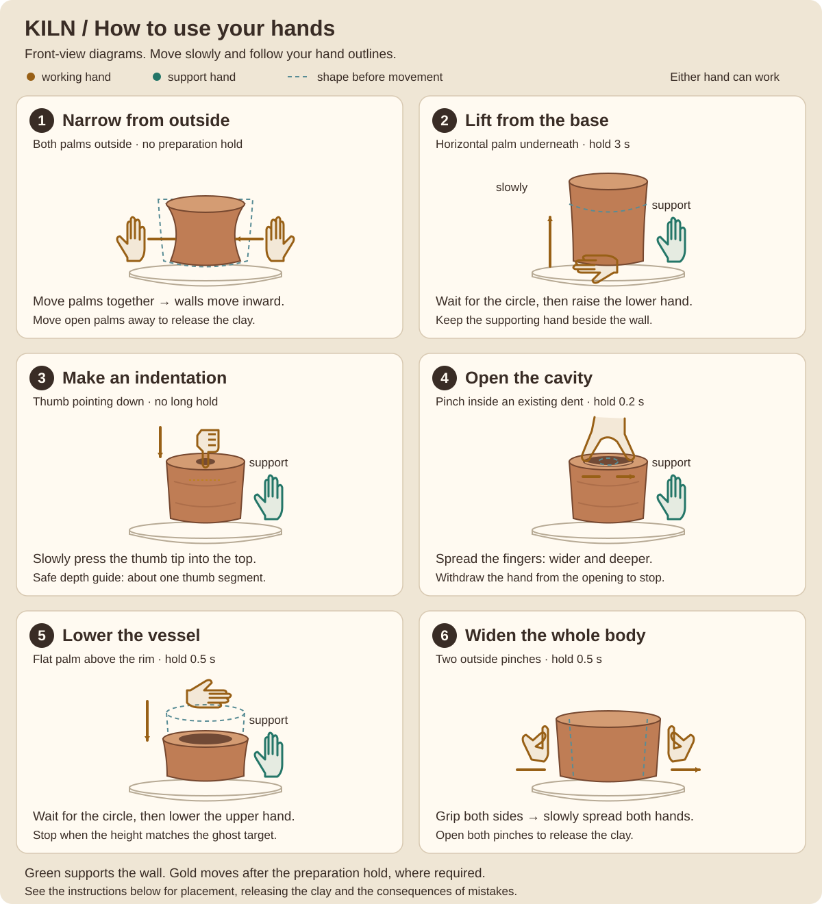

# KILN — a pottery studio controlled by your hands

**Team: Avivengers**

**ADMIT HACKATHON · MOTION: “Camera Instead of a Joystick” · Open track**

**English** · [Русский](README.ru.md)

KILN turns an ordinary webcam into a pottery tool. Shape virtual clay with both hands, create a cavity, choose a glaze and fire your vessel. The application recognizes six pottery actions, displays your hands and explains how to correct an inaccurate movement.

**[Open the studio](https://kiln-delta-rose.vercel.app/)** · **[Public repository](https://github.com/yetolegen/kiln)**

No installation is required. On your first visit, click **Start («Начать»)** and allow camera access. You can then use gestures for menus, shaping, finishing, glazing, firing and the gallery.

The game interface is currently in Russian. This guide includes the original button labels so you can find them on screen.

> This checkout includes the final update. It has not been published automatically; the public deployment may still run the earlier release. Run locally to try these features.

## Quick start

1. Open the studio on a device with a camera. A computer running Chrome with a reasonably large screen is convenient for your first session.
2. Position yourself so the camera can see **both entire hands, including fingertips**. Light your hands from the front and avoid overlapping them.
3. Wait for hand recognition to load, click **Start («Начать»)**, grant camera permission and show both open palms. Hold still briefly for calibration until the menu appears.
4. Choose **Learn · Lesson («Научиться · урок»)** to learn the actions. To start making a vessel immediately, choose **Free Sculpting («Свободная форма»)** or **Create a Vase · From a Reference («Создать вазу · по образцу»)**. Completing the lesson is optional.

The camera view is mirrored. Follow the **hand outlines and vessel on screen**: contact means aligning them in the image. **Show Camera («Показать камеру»)** makes the video brighter to help you position your hands. **Sound On / Sound Off («Звук включён» / «Звук выключен»)** toggles sound effects and also supports palm selection.

### Selecting buttons without a mouse

- Move the **center of your palm**, shown as a cyan dot on its outline, over a button.
- Hold it there until the progress circle fills. Ordinary selections take about **0.9 seconds**. Done, restart, exit and inspection during shaping take **1.8 seconds**.
- Move your palm away after activation. Leaving the button before completion resets its progress.
- You can also point your index finger at a button while curling the other fingers. Palm position is the main navigation method.
- Finishing and exit buttons hide during active shaping to prevent accidental selection. **Release the clay and move your hands away**; the buttons return after about half a second.

## How to sculpt: six actions

For actions that require support, **either hand can be the working hand**. Keep the other palm beside the wall, within the vessel's height. Keep the same hand roles throughout each action.

**Feedback:** a green ring and **Support («Опора»)** label identify the supporting hand. A gold ring shows preparation progress on the working hand. For actions with a hold, wait until the ring fills and **Slowly («Медленно»)** appears before moving.



### 1. Narrow the vessel from outside

1. Open both palms, straighten your fingers and move your thumbs away from your index fingers.
2. Place your hands **outside the left and right walls**, at the same height. For lesson step 1, work around the middle of the vessel.
3. Bring the inner edges of the hand outlines to the walls. Slowly move the left palm rightward and the right palm leftward, as though squeezing the clay between them.
4. The walls move inward at the contact height. Stop at the transparent target or your preferred width.

**To stop:** move your palms outward, away from the walls. This releases the clay. For another press, leave contact first, then bring your hands back. Holding still should not keep narrowing the vessel.

### 2. Lift and stretch the vessel

1. Support a side wall with one open palm.
2. Bring your other hand **horizontally to the base, slightly underneath it**. Point your fingers sideways, as though scooping up the clay with the edge of your palm.
3. Maintain support and hold the lower hand still for **about 3 seconds**, until the circle fills.
4. **Raise the lower hand very slowly.** The vessel grows taller; keep the supporting palm against the wall.

**To stop:** stop at the desired height and move the working hand sideways out of the base area. If the action is cancelled, return to the starting position and wait for a full circle again. In the lesson, keep the top within the target silhouette.

### 3. Make the initial thumb indentation

1. Keep one open palm beside the wall for support.
2. Curl the other fingers of your working hand and **point its thumb downward**.
3. Align the thumb tip with the **center of the clay's top surface**.
4. Slowly lower the tip a little into the clay. The indentation deepens with the tip's movement; you can bend the thumb while keeping the palm still.

**Depth guide:** in the lesson, stop at the cyan floor marker. The yellow line marks the safe guide depth: roughly **one segment of the thumb**. The initial dent needs only a small press; it has no long preparation hold.

**To stop:** lift the thumb out of the clay. Pressing too quickly cancels the action and shows advice. Pressing too deeply thins the bottom and can puncture it. Depth is scaled to the tracked hand, not measured in real centimeters.

### 4. Widen and deepen the opening

1. Make a thumb indentation first. Keep one palm supporting the outside wall.
2. Bring the working hand's **thumb and index finger together in a pinch** and place their tips **inside the existing indentation**.
3. Hold the closed pinch for about **0.2 seconds**, until the circle fills.
4. Slowly spread those fingers. The opening becomes **wider and deeper**, and the walls become thinner.

**To stop:** withdraw the working hand from the opening. Simply stopping the spread is insufficient for a long pause: the stretching timer continues while the opening gesture remains engaged. After about **7 seconds**, the walls become dangerously thin; continuing can tear them. In the lesson, stop earlier when the target width is reached.

### 5. Lower the vessel and compress the rim

1. Hold one open palm **vertically beside the vessel**, supporting its wall.
2. Hold the other palm **horizontally just above the rim**, as though resting it on the clay. Point its fingers sideways. Your hands form an angle: one beside the vessel, one above it. They do not need to touch each other.
3. Hold the upper palm still for about **0.5 seconds**, until the circle fills.
4. Slowly and steadily **lower the upper palm**, maintaining side support. The vessel becomes shorter and its rim becomes smoother. Continuing the movement increases compression.

**To stop:** stop when the top aligns with the silhouette, then move the working hand away from the rim. Height changes follow hand movement; the camera does not measure pressure. Excessive compression flattens the clay into a pancake and requires a restart.

### 6. Widen the vessel's body

**To increase the overall width, no opening is required:**

1. Place your hands outside the left and right walls, at roughly the same height.
2. Pinch the thumb and index finger of **each hand** together, as though gripping the vessel from both sides.
3. Hold still for about **0.5 seconds**, until the preparation circles fill.
4. Slowly **spread both hands sideways**, keeping both pinches closed. The entire outer profile widens; this action does not expand the cavity itself.
5. **Open both pinches**, then move your hands away. This stops widening. Moving only one hand does not widen the body.

Ordinary open palms still narrow the vessel when brought together and release it when moved outward. Use two closed pinches for deliberate widening. A sudden movement cancels the action: open your fingers and prepare again.

**Alternative: widen a wall locally from inside.**

This method is available in **Free Sculpting and Reference mode**. It requires an existing cavity with enough depth.

1. Support an outside wall with one palm.
2. Point the working hand's **index finger downward** into the opening, at the height you want to widen. Keep the thumb above the index fingertip, without pinching them together.
3. Hold still for about **0.3 seconds**, until the circle fills.
4. Slowly move the index finger **from inside toward either wall**. The outer profile widens at the fingertip's height.

**To stop:** withdraw the finger. Returning toward the center adds no further widening. Work in short strokes at nearby heights for a smooth profile.

**Action differences:** outside palms narrow the shape; two outside pinches widen the whole body; spreading two fingers of one hand inside enlarges the cavity; an inside index finger widens the wall at a chosen height.

## From the first movement to a finished vessel

### A lesson with transparent targets

The lesson teaches narrowing, widening the whole body, lifting, making an indentation, opening the cavity and compressing the rim. It has **seven screens**: six actions followed by **Training Complete («Обучение окончено»)**. Widening is step 2, immediately after narrowing.

Each action has a cyan target silhouette and a **Shape («Форма»)** indicator. Progress depends on the resulting geometry: height, wall profile, cavity width and cavity depth. Once the shape matches, stop moving and release the gesture to continue. Holding one pose does not skip several steps.

Exceeding the permitted shape or damaging the clay stops progression. Read the explanation and choose **Try Again · From Step One («Попробовать снова · с первого шага»)**. This restarts the entire lesson attempt. After completing the lesson, return to the studio and begin Free Sculpting or Reference mode.

### Shape → personalize → fire → result

1. Choose **Free Sculpting («Свободная форма»)** or **Create a Vase · From a Reference («Создать вазу · по образцу»)** and shape the vessel with the actions above.
2. Release the clay, then select **Done: decorate («Готово: к оформлению»)**. The base shape is fixed.
3. Optionally open **Details and stamps («Детали и штампы»)**. Decoration can be skipped.
4. Choose a glaze; use **← Глазури / Глазури →** to browse **Amber, Jade, Milk, Cobalt, Plum, Coral, Graphite and Honey**. Selection enables **Fire («В печь»)**.
5. Select Fire and wait about **4 seconds**. The result shows time, technique and tracking mistakes, restorations and decoration errors separately. Reference mode also shows shape similarity.
6. The vessel is automatically added to **My Shelf («Моя полка»)**. Open it in 3D, export PNG or share a link. The shelf holds up to 24 works in this browser. Storage failure is reported as temporary, memory-only storage.

### Save a checkpoint and recover

Release the clay and select **Save checkpoint («Сохранить точку»)** during shaping or decoration. A second save asks before replacing the one manual point. This is separate from the finished-work shelf.

**Restore («Восстановить»)** returns geometry, stage, glaze and confirmed decoration. Later changes are lost; elapsed shaping time and mistakes are retained, and the restore count increases. After restoring, move your hands away and release the gesture before starting again. Old observations cannot deform the restored clay.

A permanent bottom hole, rim tear or pancake opens a central dialog with its cause and **Restore checkpoint / Start again / Studio** actions. Without a point, restoration is disabled with an explanation. A stored point can be resumed from the menu after reload. It cannot be replaced by a destroyed vessel or restored after firing. The original shaping lesson repeats from step one and remains separate from personal points.

### Inspect the vessel from any angle

Release the clay and select **Inspect in 3D («Осмотреть в 3D»)**, or **Inspect vessel («Осмотреть сосуд»)** on a shelf card.

1. Open your thumb and index finger, away from all buttons.
2. Bring them together and hold briefly. Move this pinched hand left/right or up/down: the view follows continuously.
3. Open the pinch to stop. After tracking loss, switching hands or resizing, open and make a new pinch; an old grab is never resumed.
4. Dwell over **+ / −**, **Top**, **Bottom** or **Reset view** for framing. Mouse drag, wheel and touch remain optional alternatives.
5. Choose **Return to vessel («Вернуться к сосуду»)**. Shaping is paused throughout inspection. A shelf work is read-only; viewing and exporting it do not change the draft, scores or gallery page.

### Add a detail or stamp

1. After Done, open **Details and stamps**. In its **rotation** mode, inspect with the pinch-drag gesture above.
2. Choose **Add detail** → oval lump, cylinder or cone; or **Add stamp** → star, dots or wave.
3. Aim the **index fingertip** at a visible outside wall, or the rim for an attachment. A green preview indicates a valid surface. The wheel, inside, bottom and unseen back wall are excluded. Rotate first to reach another side.
4. Briefly hold a thumb/index pinch to place the preview, then open your fingers. Use dwell controls for detail length/width, tilt and rotation, or stamp size, color and rotation.
5. Select **Apply («Применить»)** to commit. **Cancel** discards this edit. **Move** returns to placement. **My details and stamps** lets you select an existing item to edit or delete.
6. Return to glaze and firing. Limits: **6 details and 8 stamps**; detail length 0.08–0.8, width 0.08–0.45, aspect ratio at most 4:1; stamp size 0.08–0.45 in game units. Invalid changes give advice and do not modify the piece.

Confirmed decoration follows the vessel through checkpoint, firing, shelf, 3D view, PNG and link. Stamps are surface drawings, not engraving; attachments are not guaranteed to form one watertight printable mesh.

### Share without requiring a camera

Select **Share vessel («Поделиться сосудом»)** on the result screen or **Share** in a shelf view. The dialog shows the URL even if clipboard access fails. Send the link yourself.

The recipient opens a **read-only viewer before camera/model startup**, using mouse or touch. **Enable hand control** explicitly requests the optional camera; denial leaves viewing available. Opening a link does not add it to the recipient's shelf. It contains geometry, glaze and decoration, not video, landmarks, session statistics or checkpoints. The versioned gzip payload in the URL fragment is limited to **12,000 characters and 64 KiB decompressed data**. Invalid or unknown links show an error.

### Short lessons for the new tools

Select **Lessons · new features («Уроки · новые возможности»)**: recovery, hand rotation, adding/deleting a detail, stamp/glaze, or shelf/sharing. Each uses a labeled prepared training vessel and separate temporary checkpoint/shelf. Personal work and records remain untouched. Success requires the resulting state, not simply hovering a button. **Repeat** restarts the module; **Skip** exits without marking it complete.

## Mistake mode: what went wrong and how to fix it

KILN checks pose, contact position, support, preparation time and movement speed. Advice above the heading explains **what to change**. Hand outlines, preparation circles and contact highlights help you locate the problem.

The following examples are English translations of the in-game Russian hints:

| Situation | Example hint | Correction |
|---|---|---|
| Right palm is too far from the wall | “Bring your right hand to the right wall.” | Align its outline with the vessel's right side |
| Working hand is vertical instead of horizontal | “Open your right palm and turn your wrist horizontally, with fingers pointing sideways.” | Rotate the hand, then wait for the preparation circle |
| Lifting starts too quickly | “Raise your hand more slowly. Hold it horizontally at the base for three seconds again.” | Return to the base, prepare again and lift smoothly |
| There is no indentation to open | “First make a shallow indentation with your thumb pointing down, supporting the wall with your other hand.” | Create the initial dent before pinching inside it |
| Working hand moves without support | “Keep the palm of your left hand beside the wall for support.” | Restore side support and prepare the action again |
| Camera loses the hands | “Tracking lost. Bring your hands back into view and separate them. The clay is paused.” | Show both hands and wait for stable outlines |

**Technique mistakes and tracking failures are handled separately.** Unreliable input pauses deformation. A hand outline briefly preserved on screen does not keep shaping the clay. Tracking issues are listed separately from execution mistakes in the results.

### Visible consequences of mistakes

- Excessive thumb insertion thins the bottom and can make a hole through it.
- Prolonged opening or critically thin walls causes a tear **starting at the rim**.
- Excessive vertical compression creates a flat pancake. At around 20% of the initial height, this becomes a terminal failure.
- An excessively tall or unstable vessel can slump. In the lesson, exceeding the target's permitted bounds also stops the step.

Serious damage displays **“The clay is ruined. Start again.” («Глина испортилась, начните заново»)** with its cause and restart instructions. Withdraw your hands and select **Start Again («Начать сначала»)**. A punctured bottom, terminal wall tear or pancake blocks further shaping until restart or restoration of a valid checkpoint. Minor damage produces technique advice and may be repaired by rim compression; a light scratch does not require restarting.

## How KILN meets the MOTION case

| Requirement | Implementation |
|---|---|
| Webcam recognition in the browser | Real-time tracking of two hands, their poses and movements |
| At least three distinct gestures | Six actions with different effects on clay; navigation is separate |
| Clear feedback | Hand outlines, support markers, preparation circles, contact highlights, target silhouettes and visible deformation |
| A complete scenario | Shaping → Done → glazing → firing → result, image export and gallery |
| No installation for players | Public HTTPS link; a browser and camera permission are enough |
| Required mistake mode | Technique checks, specific corrective advice, warnings and visible damage |
| Custom recognition logic | Rules for pose, contact and speed, gesture holds, filtering and tolerance for small fluctuations |
| Progress / high scores | A personal shelf and best reference-matching scores |
| Phone camera support | Responsive layout, orientation handling and touch inspection |
| Sound and visual effects | Wheel and shaping sounds, firing, rotation, clay splashes and glaze appearance |

## Run from source

You need **Node.js 24.x**, npm, Git, a webcam and an internet connection for the initial dependency and recognition-component downloads.

```sh
git clone https://github.com/yetolegen/kiln.git
cd kiln
npm ci
npm run dev
```

Open the local URL printed by Vite, click Start («Начать») and allow camera access. Camera access works on `localhost`. Access from another device requires **HTTPS**; an ordinary HTTP URL using your computer's IP address may not allow the camera.

Build and preview the production application locally:

```sh
npm run build
npm run preview
```

Deploy to a host that supports Vite: use `npm run build` as the build command and `dist` as the output directory. A Vercel configuration is included. No API keys or application backend are required.

Run checks:

```sh
npm run typecheck
npm test
npx playwright install chromium
npm run test:browser -- --project=chromium
```

## Technical implementation and components

**Custom project logic:** movement interpretation, working/supporting hand assignment, contact checks, action preparation and cancellation, vessel deformation, mistake detection, target comparison, lessons and the game flow. These are implemented in TypeScript.

**MediaPipe Hand Landmarker** supplies hand and finger coordinates. KILN's rules determine each gesture's meaning and effect on the clay. **Three.js** renders the vessel. The interface uses TypeScript, HTML and CSS; sound uses Web Audio. Vite builds the application, and Vitest and Playwright run the checks. Dependencies are listed in [package.json](package.json).

Code is organized by responsibility:

- `src/tracking` — camera observations, coordinates, filtering and gesture recognition;
- `src/engine` — clay geometry, game limits, mistakes, targets and statistics;
- `src/render` — vessel, wheel, effects and hand visualization;
- `src/ui` — menus, dwell selection, lessons, hints and results;
- `src/browser` — camera and local storage; `src/audio` — sound.

The vessel model, diagrams and effects are generated in code; sounds are synthesized in the browser. The decorative studio backdrop was created with image generation; its [source and prompt](docs/WORKSHOP_ART.md) are documented separately.

## Operating conditions and limitations

- Video frames are processed in the browser and are not sent to an application server. The microphone is not requested. The browser downloads the recognition model and WASM components.
- Keep your fingers visible, avoid overlapping hands and move slowly. If recognition is unclear, check the outlines and advice. If a circle does not fill, check support and working-hand placement first.
- The layout adapts to computers and phones. Recognition depends on the camera, lighting, browser and device performance. Automated tests with simulated hands do not guarantee identical recognition on every physical device.
- Free 3D inspection requires WebGL. A simplified 2D vessel display is available if the graphics context is lost.
- This is a game model of clay. The camera estimates positions and movement, not real force, physical thickness or exact material volume.

## Final demonstration and evidence

Final criteria supplied by the team: working live demo **25**, technical implementation **20**, UX/design **15**, development since stage one **15**, pitch/Q&A **15**, originality **10**. Evidence and limitations are documented without predicting a score:

- [Changes and baseline](docs/FINAL_CHANGELOG.md)
- [Suggested demonstration](docs/FINAL_DEMO.md)
- [Technical questions and answers](docs/FINAL_QA.md)
- [Actual tests and physical-camera checklist](docs/FINAL_TEST_REPORT.md)

## Project description for the submission form

> **KILN, team Avivengers — Open track of the MOTION case.** We built a browser-based pottery studio controlled with two hands through an ordinary webcam. Six actions let the player narrow and lift a vessel, make an indentation, open its cavity, compress its rim and widen its body. After shaping, the player chooses a glaze, fires the piece and receives a finished vessel and statistics, plus a similarity score in Reference mode. Works and best scores are saved in a personal gallery.
>
> **Mistake mode** checks hand placement, support, hold time and speed. It gives concrete advice such as “Bring your right hand to the right wall,” “Open your right palm and turn your wrist horizontally, with fingers pointing sideways,” “Raise your hand more slowly; hold it horizontally at the base for three seconds again,” and “First make a shallow indentation with your thumb pointing down, supporting the wall with your other hand.” These hints appear in Russian in the game. Mistakes have visible consequences: thinning, tears, bottom holes or flattening. Tracking loss pauses shaping and is counted separately. MediaPipe supplies hand coordinates; action recognition, technique checks and gameplay use the project's own logic.

The final update adds manual recovery, continuous hand inspection, attachments and stamps, eight glazes and a camera-free sharing viewer. New lessons use isolated training work; original pottery gestures and the widening target are preserved.
