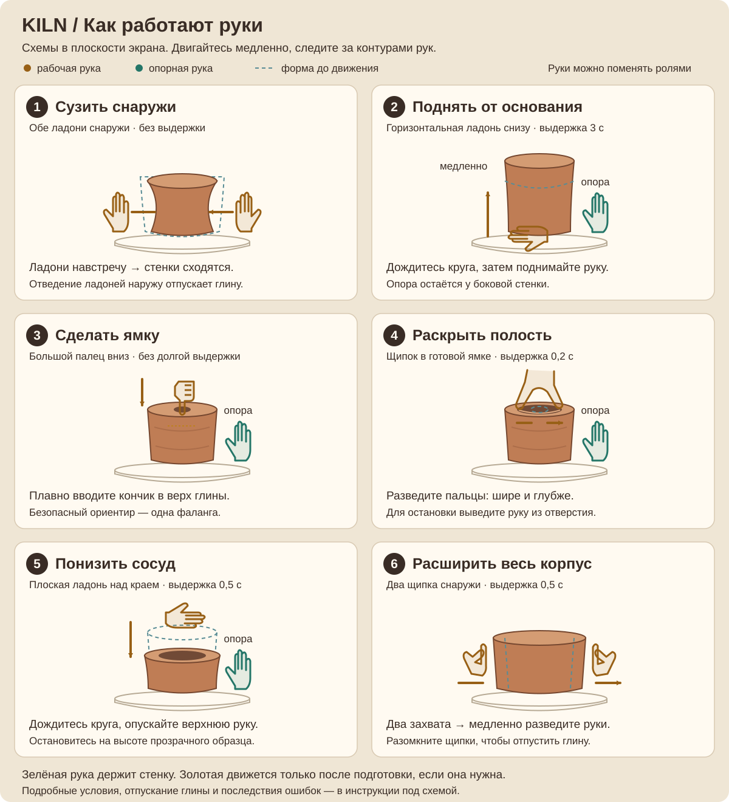

# KILN — гончарная мастерская, управляемая руками

[English](README.md) · **Русский**

**Команда: Avivengers**

**ADMIT HACKATHON · MOTION: «Камера вместо джойстика» · свободное направление**

KILN превращает обычную веб-камеру в инструмент для лепки. Пользователь формует виртуальную глину двумя руками, создаёт полость, подбирает глазурь и обжигает сосуд. Приложение распознаёт шесть гончарных действий, показывает положение рук и объясняет, как исправить неверное движение.

**[Открыть мастерскую](https://kiln-delta-rose.vercel.app/)** · **[Публичный репозиторий](https://github.com/yetolegen/kiln)**

Устанавливать приложение не нужно. Для первого запуска нажмите «Начать» и разрешите камеру в браузере. Затем меню, лепка, завершение, глазурь, обжиг и галерея доступны через жесты.

> Этот checkout содержит финальное обновление. Оно не публиковалось автоматически; публичный сайт может работать на предыдущей версии. Для новых функций запустите проект локально.

## Быстрый старт

1. Откройте мастерскую на устройстве с камерой. Для первого знакомства удобнее компьютер с Chrome и достаточно большой экран.
2. Расположитесь так, чтобы камера видела **обе кисти целиком**, включая кончики пальцев. Осветите руки спереди; не перекрывайте одну кисть другой.
3. Дождитесь загрузки распознавания, нажмите **«Начать»**, разрешите камеру и покажите обе раскрытые ладони. Ненадолго замрите для калибровки, пока не появится меню.
4. Для знакомства с действиями выберите **«Научиться · урок»**. Чтобы сразу создать сосуд, выберите **«Свободная форма»** или **«Создать вазу · по образцу»**. Проходить урок перед этими режимами необязательно.

Изображение зеркальное. Ориентируйтесь на **контуры рук и сосуд на экране**: контакт означает их совмещение в изображении. Кнопка «Показать камеру» делает видео ярче и помогает выставить руки. Кнопка «Звук включён» / «Звук выключен» переключает звуковые эффекты; она тоже доступна удержанием ладони.

### Как выбирать кнопки без мыши

- Подведите **центр ладони** — голубую точку на её контуре — к нужной кнопке.
- Задержите ладонь, пока круг указателя не заполнится. Обычный выбор занимает примерно **0,9 секунды**; «Готово», перезапуск, выход и осмотр во время лепки — **1,8 секунды**.
- После выбора отведите ладонь от кнопки. Выход из её области сбрасывает незавершённый выбор.
- Можно также направить указательный палец на кнопку, согнув остальные пальцы. Основной способ навигации — центр ладони.
- Во время лепки кнопки завершения и выхода скрываются, чтобы не срабатывать случайно. **Отпустите глину и уберите руки от неё**; примерно через полсекунды кнопки вернутся.

## Как лепить: шесть действий

Во всех действиях с опорой **любая рука может быть рабочей**. Вторая ладонь остаётся сбоку у стенки, в пределах высоты сосуда. Не меняйте роли рук посреди движения.

**Обратная связь:** зелёное кольцо и надпись «Опора» отмечают поддерживающую руку. Золотой круг у рабочей руки показывает подготовку действия. Если для жеста нужна выдержка, начинайте движение после заполнения круга и появления «Медленно».



### 1. Сузить сосуд снаружи

1. Раскройте обе ладони, расправьте пальцы и отведите большие пальцы от указательных.
2. Разместите руки **снаружи слева и справа от сосуда**, на одинаковой высоте. Для первого шага урока выберите середину сосуда.
3. Подведите внутренние края контуров рук к стенкам. Медленно двигайте левую ладонь вправо, а правую — влево, как будто сжимаете глину между ними.
4. Стенки в месте касания постепенно сойдутся. Остановитесь у прозрачного образца или на желаемой ширине.

**Как закончить:** отведите ладони наружу, от стенок. Это отпускает глину. Чтобы начать новый нажим, сначала выйдите из контакта, затем снова подведите руки. Удержание без движения не должно продолжать сужение.

### 2. Поднять и вытянуть сосуд

1. Одной раскрытой ладонью поддерживайте боковую стенку.
2. Вторую руку подведите **горизонтально к основанию, немного под дно**. Пальцы направлены в сторону, словно вы подхватываете глину снизу ребром ладони.
3. Сохраняйте опору и держите нижнюю руку неподвижно **около 3 секунд**, пока круг не заполнится.
4. **Очень медленно поднимайте нижнюю руку**. Высота сосуда будет увеличиваться; опорную ладонь продолжайте держать у стенки.

**Как закончить:** остановитесь на нужной высоте и выведите рабочую руку из области основания в сторону. Если движение отменилось, снова займите исходное положение и дождитесь полного круга. В уроке не поднимайте сосуд выше целевого силуэта.

### 3. Сделать начальную ямку большим пальцем

1. Оставьте одну раскрытую ладонь у боковой стенки как опору.
2. На рабочей руке согните остальные пальцы и **направьте большой палец вниз**.
3. Совместите его кончик с **центром верхней поверхности** глины.
4. Плавно опустите кончик немного внутрь сосуда. Ямка появляется и углубляется вслед за движением; можно сгибать большой палец, сохраняя положение кисти.

**Ориентир глубины:** в уроке остановитесь у голубой отметки дна. Жёлтая линия обозначает безопасный ориентир — примерно **одна фаланга большого пальца**. Для начальной ямки достаточно небольшого нажатия; долгой предварительной выдержки здесь нет.

**Как закончить:** выведите большой палец вверх из глины. Слишком быстрое нажатие отменяется с подсказкой; слишком глубокое истончает и может пробить дно. Это условный масштаб по размеру руки, а не измерение глубины в сантиметрах.

### 4. Расширить и углубить отверстие

1. Сначала создайте ямку большим пальцем. Одна ладонь по-прежнему поддерживает стенку снаружи.
2. Соедините **большой и указательный пальцы** рабочей руки в щипок и поместите их кончики **внутрь существующей ямки**.
3. Задержите сомкнутый щипок примерно **0,2 секунды**, до заполнения круга.
4. Медленно увеличивайте расстояние между пальцами. Отверстие станет **шире и глубже**, а стенки — тоньше.

**Как закончить:** выведите рабочую руку из отверстия. Одного прекращения разведения недостаточно для долгой паузы: пока рука остаётся в активном раскрытии, продолжает идти время растягивания. Примерно через **7 секунд** появляется опасность истончения; продолжение может разорвать стенку. В уроке останавливайтесь у целевой ширины раньше.

### 5. Понизить сосуд и уплотнить край

1. Одну раскрытую ладонь держите **вертикально сбоку**, поддерживая стенку.
2. Другую раскройте **горизонтально над верхним краем**, словно кладёте её на поверхность глины. Пальцы направьте в сторону. Положение рук напоминает угол: одна рука сбоку, другая сверху; соприкасаться друг с другом они не должны.
3. Не двигайте верхнюю ладонь примерно **0,5 секунды**, пока круг не заполнится.
4. Медленно и равномерно **опускайте верхнюю ладонь**, сохраняя боковую опору. Сосуд станет ниже, край выровняется. Продолжение движения усиливает сжатие.

**Как закончить:** остановитесь, когда верх сосуда совпадёт с силуэтом, и уберите рабочую руку от края. Здесь высота меняется от движения руки, камера не измеряет силу давления. Если продолжать нажим слишком долго, глина превратится в плоскую лепёшку и потребует перезапуска.

### 6. Расширить корпус сосуда

**Чтобы расширить стенку на нужной высоте, отверстие не требуется:**

1. Расположите руки снаружи у левой и правой стенок, на той высоте, которую хотите расширить.
2. Соедините большой и указательный пальцы **каждой руки** в щипок — словно захватываете сосуд с двух сторон.
3. Замрите примерно на **0,5 секунды**, пока круги подготовки не заполнятся.
4. Медленно **разведите обе руки в стороны**, сохраняя щипки. Стенка станет шире на высоте щипков, плавно переходя в соседние участки; полость отдельно не расширяется.
5. **Разомкните щипки**, затем уберите руки. Это прекращает расширение. Перемещение только одной руки не расширяет корпус.

Обычные раскрытые ладони по-прежнему сужают сосуд при движении навстречу; их отведение наружу отпускает глину. Два сомкнутых щипка нужны именно для намеренного расширения. Резкий рывок отменяет расширение: разомкните пальцы и начните подготовку заново.

**Дополнительный способ: расширить стенку локально изнутри.**

Доступно в **свободной лепке и режиме по образцу**. Сначала нужны ямка и отверстие достаточной глубины.

1. Одной ладонью поддерживайте боковую стенку снаружи.
2. Рабочий **указательный палец направьте вниз** и опустите его кончик в отверстие, на высоту участка, который хотите расширить. Большой палец держите выше кончика указательного; не соединяйте их в щипок.
3. Задержите руку примерно **0,3 секунды**, до заполнения круга.
4. Медленно двигайте указательный палец **изнутри к левой или правой стенке**. Внешний профиль сосуда расширится на высоте кончика пальца.

**Как закончить:** выведите палец из отверстия. Возврат пальца к центру не добавляет расширения. Для плавного профиля работайте короткими движениями на соседних высотах.

**Различие действий:** ладони снаружи сужают форму; два щипка у внешних стенок расширяют стенку на своей высоте; разведение пальцев одной руки внутри увеличивает полость; указательный палец изнутри расширяет стенку на выбранной высоте.

## От первого движения до готового сосуда

### Урок с прозрачным образцом

Урок последовательно учит сужению, расширению середины, подъёму, начальной ямке, раскрытию и уплотнению края. Всего **семь экранов**: шесть действий и **«Обучение окончено»**. Расширение — второй шаг, сразу после сужения.

У каждого действия есть голубой целевой силуэт и показатель **«Форма»**. Переход проверяет результат лепки: высоту, профиль стенок, ширину и глубину полости. Когда форма совпадёт, прекратите движение и отпустите жест, чтобы перейти дальше. Удержание одной позы не пропускает несколько этапов.

При выходе за допустимую форму или повреждении продвижение останавливается. Прочитайте причину и выберите **«Попробовать снова · с первого шага»**. Эта кнопка начинает учебную попытку с первого шага. После завершения урока вернитесь в мастерскую и начните свободную лепку или работу по образцу.

### Лепка → оформление → обжиг → результат

1. Выберите **«Свободная форма»** или **«Создать вазу · по образцу»** и сформируйте сосуд действиями выше.
2. Отпустите глину и выберите **«Готово: к оформлению»**. Основная форма зафиксируется.
3. По желанию откройте **«Детали и штампы»**. Оформление можно пропустить.
4. Листайте **«← Глазури / Глазури →»**: доступны **Янтарь, Нефрит, Молоко, Кобальт, Слива, Коралл, Графит и Мёд**. Выбор активирует **«В печь»**.
5. Выберите «В печь» и подождите около **4 секунд**. В результате указаны время, ошибки техники и отслеживания, восстановления и ошибки оформления отдельно. Режим по образцу также показывает совпадение формы.
6. Работа автоматически попадает на **«Мою полку»**. Её можно открыть в 3D, выгрузить PNG или поделиться ссылкой. Полка хранит до 24 работ в этом браузере. При отказе хранилища приложение сообщает, что сохранение временное — до закрытия страницы.

### Сохранить точку и восстановить работу

Уберите руки от глины и выберите **«Сохранить точку»** во время лепки или оформления. Повторное сохранение требует подтверждения замены единственной точки. Это отдельная функция, не сохранение готовой работы на полку.

**«Восстановить»** возвращает форму, этап, глазурь и подтверждённое оформление. Поздние изменения теряются; время лепки и ошибки сохраняются, счётчик восстановлений увеличивается. После восстановления уберите руки и отпустите жест, затем начинайте новое движение. Старые кадры не портят восстановленную форму.

Пробитое дно, окончательный разрыв края или сплющивание вызывают центральное окно с причиной и действиями **«Восстановить точку» / «Начать сначала» / «В мастерскую»**. Если точки нет, восстановление недоступно и объяснено почему. Точку можно продолжить из меню после перезагрузки. Нельзя заменить её разрушенной формой или восстановить после обжига. Основной урок повторяется с первого шага; личная точка от него отделена.

### Рассмотреть сосуд со всех сторон

Отпустите глину и выберите **«Осмотреть в 3D»** либо **«Осмотреть сосуд»** на карточке полки.

1. Разомкните большой и указательный пальцы вдали от кнопок.
2. Соедините их и ненадолго задержите щипок. Ведите руку влево/вправо или вверх/вниз — вид плавно следует за движением.
3. Разомкните щипок, чтобы остановиться. После потери отслеживания, смены руки или размера окна раскройте пальцы и захватите заново: старый захват не продолжается.
4. Удерживайте ладонь над **+ / −**, **«Сверху»**, **«Снизу»**, **«Сбросить вид»** для выбора ракурса. Мышь, колесо и касание остаются дополнительными способами.
5. Выберите **«Вернуться к сосуду»**. Лепка во время осмотра приостановлена. Работа с полки открывается только для просмотра: осмотр и экспорт не меняют черновик, рекорды или страницу галереи.

### Добавить деталь или штамп

1. После «Готово» откройте **«Детали и штампы»**. В режиме **вращения** осмотрите сосуд щипком, как описано выше.
2. Выберите **«Добавить деталь»** → овальный комок, цилиндр или шип; либо **«Добавить штамп»** → звезда, точки или волна.
3. Наведите **кончик указательного пальца** на видимую внешнюю стенку (для объёмной детали также доступен ободок). Зелёный предварительный образ показывает допустимое место. Круг, внутренняя часть, дно и невидимая обратная стенка исключены. Для другой стороны сначала поверните сосуд.
4. Ненадолго соедините большой и указательный пальцы, закрепив размещение, затем разомкните их. Кнопками с удержанием ладони меняйте длину, ширину, наклон и поворот детали либо размер, цвет и поворот штампа.
5. Выберите **«Применить»**. **«Отмена»** отбрасывает текущее изменение. **«Переместить»** возвращает к размещению. Через **«Мои детали и штампы»** выберите существующий элемент для изменения или удаления.
6. Вернитесь к глазури и обжигу. Допускается до **6 деталей и 8 штампов**. Длина детали 0,08–0,8, ширина 0,08–0,45, отношение сторон до 4:1; размер штампа 0,08–0,45 в игровых единицах. Недопустимое изменение даёт подсказку и не применяется.

Подтверждённое оформление сохраняется в точке, после обжига, на полке, в 3D, PNG и ссылке. Штамп — рисунок, не гравировка. Накладные детали не гарантируют единую герметичную сетку для печати.

### Поделиться сосудом без обязательной камеры

Выберите **«Поделиться сосудом»** в результате или **«Поделиться»** при осмотре с полки. Диалог показывает URL даже при отказе буфера обмена. Отправьте ссылку самостоятельно.

Получатель открывает **просмотр без камеры и загрузки модели распознавания**, управляя мышью или касанием. **«Включить управление руками»** отдельно запрашивает камеру; отказ не мешает просмотру. Ссылка не добавляет работу на чужую полку. В ней только форма, глазурь и оформление — без видео, landmarks, статистики и контрольных точек. Формат: версионированный gzip в URL hash, максимум **12 000 символов и 64 КиБ после распаковки**. Повреждённая или неизвестная ссылка вызывает понятную ошибку.

### Короткие уроки новых возможностей

В меню выберите **«Уроки · новые возможности»**: восстановление, вращение руками, добавление/удаление детали, штамп/глазурь или полка/ссылка. Каждый модуль использует явно обозначенный подготовленный учебный сосуд и отдельные временные точку/полку. Личные работы и рекорды не меняются. Успех требует результата действия, а не простого наведения на кнопку. **«Повторить»** начинает модуль заново; **«Пропустить»** выходит без отметки об успехе.

## Режим «ошибка»: что не так и как исправить

KILN проверяет позу, место контакта, наличие опоры, время подготовки и скорость движения. Подсказка над заголовком сообщает, **что изменить**, а контуры рук, круг подготовки и подсветка участка помогают найти ошибку.

| Ситуация | Пример подсказки в игре | Что сделать |
|---|---|---|
| Правая ладонь далеко от стенки | «Поднеси правую руку к правой стенке» | Совместить контур руки с правым боком сосуда |
| Рабочая кисть стоит вертикально вместо горизонтального положения | «Раскройте правую ладонь и поверните кисть горизонтально — пальцы в сторону.» | Развернуть кисть, затем дождаться круга подготовки |
| Подъём начат слишком резко | «Поднимайте руку медленнее. Снова задержите её горизонтально у основания на три секунды.» | Вернуться к основанию, заново подготовить жест и поднимать плавно |
| Нет ямки для раскрытия | «Сначала сделайте неглубокую ямку большим пальцем вниз, поддерживая стенку другой рукой.» | Сделать начальное углубление, затем перейти к щипку |
| Рабочая рука движется без опоры | «Держите ладонь левой руки у боковой стенки для поддержки.» | Вернуть опорную руку к стенке и повторить подготовку |
| Камера потеряла руки | «Отслеживание потеряно. Верните руки в кадр и разведите кисти. Глина на паузе.» | Вернуть обе руки в кадр и дождаться устойчивых контуров |

**Ошибка техники и потеря отслеживания различаются.** При ненадёжном кадре деформация приостанавливается; сохранённый на мгновение контур руки не продолжает лепить глину. В итогах проблемы распознавания учитываются отдельно от ошибок исполнения.

### Видимые последствия ошибок

- Слишком глубокое нажатие большим пальцем истончает дно, затем может сделать сквозное отверстие.
- Долгое раскрытие или критически тонкая стенка приводят к разрыву **от края сосуда**.
- Чрезмерное вертикальное сжатие превращает сосуд в лепёшку. При высоте около 20% от начальной это окончательно испорченная форма.
- Слишком высокий или неустойчивый сосуд может осесть. В уроке выход за допустимые границы силуэта также останавливает этап.

При серьёзном повреждении появляется **«Глина испортилась, начните заново»**, пояснение причины и действия восстановления. Уберите руки и выберите **«Восстановить точку»**, если она сохранена, либо **«Начать сначала»**. Сквозное дно, окончательный разрыв стенки и лепёшка блокируют дальнейшую лепку до перезапуска или восстановления допустимой точки. Небольшие повреждения сопровождаются советом исправить технику и могут устраняться уплотнением края; лёгкая царапина не требует начинать заново.

## Соответствие кейсу MOTION

| Требование | Реализация в KILN |
|---|---|
| Веб-камера и распознавание в браузере | Отслеживание двух рук, поз и движений в реальном времени |
| Не менее трёх разных жестов | Шесть действий с разными изменениями глины; навигация считается отдельно |
| Понятная обратная связь | Контуры рук, отметка опоры, круг подготовки, подсветка контакта, целевой силуэт и видимая деформация |
| Законченный сценарий | Лепка → «Готово» → глазурь → обжиг → результат, изображение и галерея |
| Запуск без установки | Публичная HTTPS-ссылка; требуется браузер и разрешение камеры |
| Обязательный режим «ошибка» | Проверка техники, конкретные корректирующие подсказки, предупреждения и видимые повреждения |
| Собственная логика распознавания | Правила поз, контакта и скорости, выдержка жестов, фильтрация и устойчивость к небольшим колебаниям |
| Прогресс / рекорды | Личная полка работ и лучший результат повторения образца |
| Камера телефона | Адаптивная компоновка, обработка изменения ориентации, поддержка сенсорного осмотра |
| Звук и визуальные эффекты | Звук круга и лепки, обжиг, вращение, брызги глины и оформление глазури |

## Запуск из исходного кода

Нужны **Node.js 24.x**, npm, Git, веб-камера и интернет для первой загрузки зависимостей и компонентов распознавания.

```sh
git clone https://github.com/yetolegen/kiln.git
cd kiln
npm ci
npm run dev
```

Откройте локальный адрес, напечатанный Vite в терминале, нажмите «Начать» и разрешите камеру. Локальная камера работает на `localhost`; при публикации на другом устройстве нужен **HTTPS**. Обычная HTTP-ссылка на IP компьютера может не дать доступ к камере.

Сборка и локальный просмотр готового приложения:

```sh
npm run build
npm run preview
```

Для публикации используйте Vite-совместимый хостинг: команда сборки `npm run build`, каталог результата `dist`. В репозитории есть конфигурация Vercel. Ключи API и сервер приложения не требуются.

Проверки:

```sh
npm run typecheck
npm test
npx playwright install chromium
npm run test:browser -- --project=chromium
```

## Техническая реализация и используемые компоненты

**Собственная логика проекта:** интерпретация движений, выбор рабочей и опорной руки, проверка контакта, подготовка и отмена действий, деформация сосуда, распознавание ошибок, сравнение формы с целью, уроки и игровой сценарий. Она реализована на TypeScript.

**MediaPipe Hand Landmarker** предоставляет координаты кистей и пальцев. Значение жеста и его влияние на глину определяются правилами KILN. **Three.js** отвечает за трёхмерный сосуд; интерфейс использует TypeScript, HTML и CSS, звук — Web Audio. Сборка выполняется Vite, проверки — Vitest и Playwright. Зависимости перечислены в [package.json](package.json).

Код разделён по назначению:

- `src/tracking` — наблюдения камеры, координаты, фильтрация и распознавание жестов;
- `src/engine` — геометрия глины, игровые ограничения, ошибки, цели и статистика;
- `src/render` — сосуд, круг, эффекты и изображение рук;
- `src/ui` — меню, выбор удержанием, обучение, подсказки и результаты;
- `src/browser` — камера и локальное хранение; `src/audio` — звуки.

Модель сосуда, диаграммы и эффекты создаются кодом; звуки синтезируются в браузере. Декоративный фон мастерской создан с помощью генерации изображений; [источник и текст запроса](docs/WORKSHOP_ART.md) указаны отдельно.

## Условия работы и ограничения

- Видеокадры обрабатываются в браузере и не отправляются на сервер приложения. Микрофон не запрашивается. Для распознавания браузер загружает модель и WASM-компоненты.
- Не перекрывайте руки, держите пальцы в кадре и избегайте резких движений. При сбое сверяйтесь с контурами и текстовой подсказкой; если круг не заполняется, сначала проверьте опору и положение рабочей руки.
- Адаптивная компоновка есть для компьютера и телефона. Точность зависит от камеры, освещения, браузера и производительности устройства; результаты автоматизированных проверок с имитацией рук не гарантируют одинаковое распознавание на всех устройствах.
- Для свободного 3D-осмотра требуется WebGL. При потере графического контекста предусмотрено упрощённое двумерное отображение сосуда.
- Это игровая модель глины: камера оценивает положения и движения, а не реальное усилие, физическую толщину или точный объём материала.

## Финальная демонстрация и доказательства

Переданная командой шкала финала: работоспособность/live demo **25**, техническая реализация **20**, UX/дизайн **15**, развитие после первого этапа **15**, питч/ответы **15**, оригинальность **10**. Возможности и ограничения описаны без обещаний баллов:

- [Изменения и исходный commit](docs/FINAL_CHANGELOG.md)
- [Предлагаемый сценарий демонстрации](docs/FINAL_DEMO.md)
- [Технические вопросы и ответы](docs/FINAL_QA.md)
- [Фактические проверки и список для камеры](docs/FINAL_TEST_REPORT.md)

## Описание проекта для формы сдачи

> **KILN, команда Avivengers — свободное направление кейса MOTION.** Мы создали браузерную гончарную мастерскую, управляемую двумя руками через обычную веб-камеру. Шесть действий позволяют сузить и поднять сосуд, сделать ямку, раскрыть полость, уплотнить край и расширить корпус. После лепки пользователь выбирает глазурь, обжигает работу и получает готовый сосуд, статистику, а в режиме по образцу — оценку сходства. Работы и лучшие результаты сохраняются в личной галерее.
>
> **Режим «ошибка»** проверяет положение рук, опору, выдержку и скорость. Вместо общего сообщения о нераспознанном жесте появляются конкретные советы: «Поднеси правую руку к правой стенке», «Раскройте правую ладонь и поверните кисть горизонтально — пальцы в сторону», «Поднимайте руку медленнее. Снова задержите её горизонтально у основания на три секунды», «Сначала сделайте неглубокую ямку большим пальцем вниз, поддерживая стенку другой рукой». Ошибки имеют видимые последствия: истончение, разрыв, отверстие в дне или сплющивание. Потеря отслеживания ставит лепку на паузу и учитывается отдельно. MediaPipe даёт координаты рук; распознавание действий, проверка техники и игровая механика реализованы собственной логикой проекта.

Финальное обновление добавляет явное восстановление, непрерывный осмотр руками, накладные детали и штампы, восемь глазурей и просмотр по ссылке без камеры. Новые уроки используют отдельные учебные работы; исходные гончарные жесты и учебная цель расширения сохранены.
